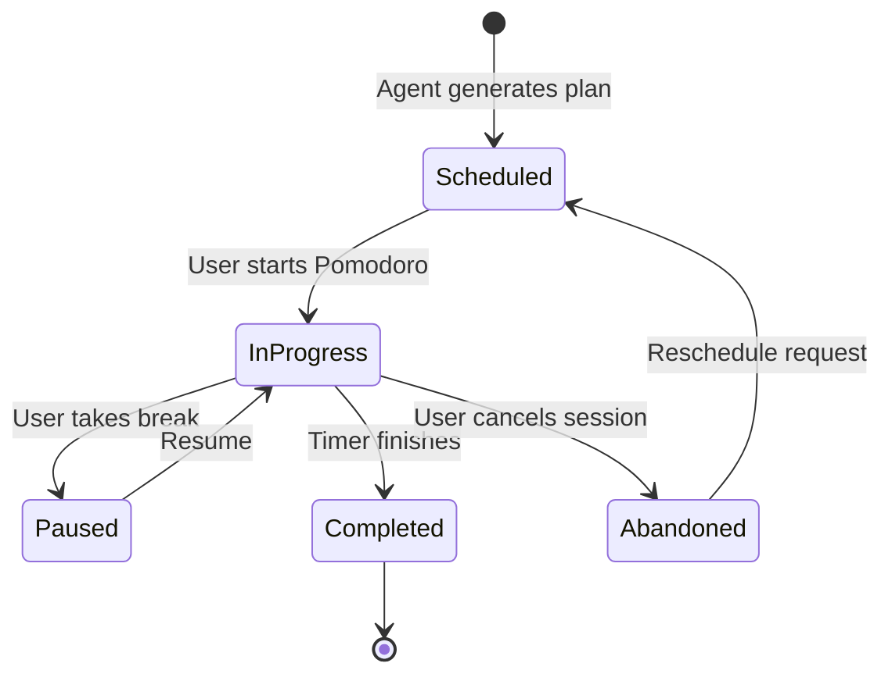
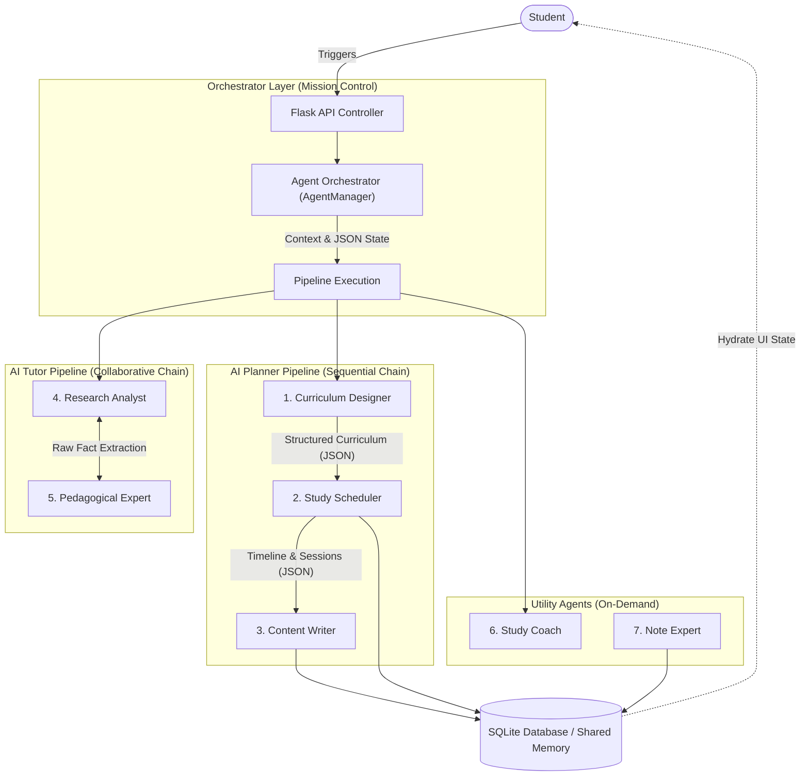
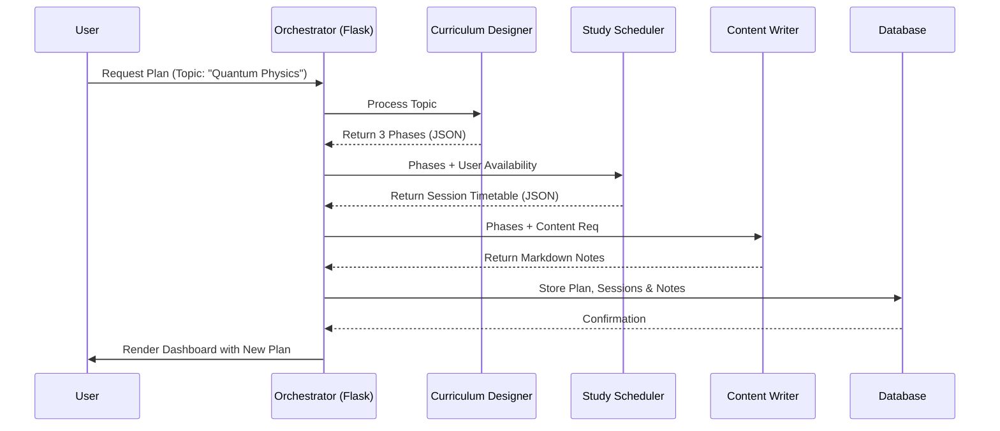
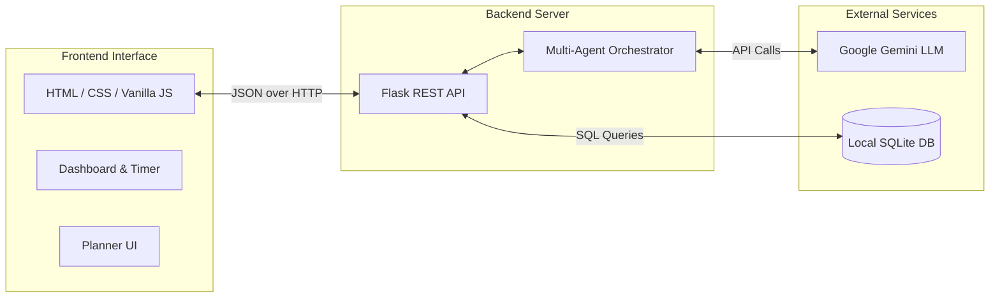
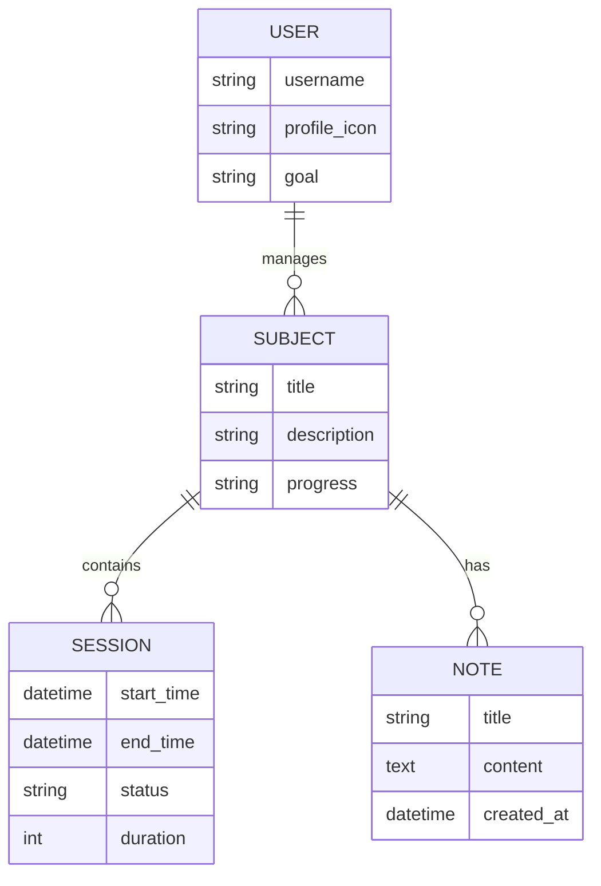

# Project Proposal: StudyMind AI
**An Autonomous, Multi-Agent Study Planner System**

---

## 1. Introduction
In today's fast-paced educational environment, students often struggle with time management, curriculum structuring, and finding personalized learning resources. **StudyMind AI** is an intelligent, web-based application designed to solve these challenges by acting as a fully autonomous study command center. 

Unlike traditional to-do lists or static calendar applications, StudyMind AI utilizes a **Multi-Agent Large Language Model (LLM) Architecture**. Rather than relying on a single, monolithic AI prompt, the system orchestrates a crew of specialized AI agents—each with a distinct role, persona, and task—to design curriculums, schedule sessions, conduct research, and tutor the student.

## 2. Problem Statement
* **Planning Fatigue:** Students spend too much time trying to figure out *what* to study and *when* to study, rather than actually studying.
* **One-Size-Fits-All:** Generic planners do not account for a student's available daily hours, specific learning goals, or current knowledge level.
* **Information Overload:** When stuck on a concept, students often have to sift through dense articles or generic chatbot responses that lack educational pedagogy.

## 3. Proposed Solution
StudyMind AI provides a centralized dashboard that automates the logistical overhead of studying. Key features include:
* **Analytics and Tracking:** Visual progress rings, streak tracking, and daily activity heatmaps.

### 3.1. Study Session Lifecycle
To ensure productivity, StudyMind AI tracks the state of every planned session.

## 4. Multi-Agent Architecture
The core innovation of StudyMind AI is its Multi-Agent System. The application utilizes a base `AIAgent` class to instantiate 7 distinct agents across different application domains. These agents do not work in isolation; they are part of a highly coordinated ecosystem.

### 4.1. Agent Breakdown
1. **Curriculum Designer:** Analyzes the topic and breaks it down into 3 logical, structured phases of study.
2. **Study Scheduler:** Takes the curriculum phases and the user's available dates/hours to generate a precise JSON timeline of study sessions.
3. **Content Writer:** Takes the curriculum phases and writes initial, comprehensive "starter notes" in Markdown.
4. **Research Analyst:** Analyzes a student's question and extracts core facts and definitions.
5. **Pedagogical Expert:** Takes the raw research data and formats it into an encouraging, easy-to-understand explanation.
6. **Study Coach:** Generates highly motivating 1-2 sentence insights for the main dashboard.
7. **Note Expert:** Instantly generates concise study notes on demand.

### 4.2. Connectivity & Communication Protocol
The agents are connected through a **Centralized Orchestration Pattern** governed by the `AgentManager` in the Python backend.

*   **Communication Format:** All agents communicate using strictly enforced **JSON schemas**. This ensures that the output of one agent (e.g., a list of study phases) can be programmatically parsed and injected into the system prompt of the next agent.
*   **Stateful Context:** Instead of simple prompt-response loops, the system maintains a "Current Plan State." As each agent completes its task, the orchestrator updates this state, effectively passing a "baton" of structured knowledge down the pipeline.
*   **Shared Memory:** The **SQLite Database** acts as the long-term shared memory. Agents can query existing subject data or user history to ensure that new plans are consistent with previous progress.

### 4.3. Working Mechanism (How They Work)
StudyMind AI agents operate on a **Pipeline Execution Model**. The following sequence diagram illustrates the handoff between agents during the primary planning workflow:

1.  **Request Parsing:** When a user requests a plan, the Orchestrator identifies the "Pipeline" required (Planner, Tutor, or Insight).
2.  **Prompt Chaining:** The Orchestrator constructs a "Dynamic Prompt" for the first agent, including the user's input and specific constraints.
3.  **Autonomous Reasoning:** Each agent is given a specific "Persona" (e.g., "You are an expert curriculum architect"). It processes the input and generates a response that adheres to the JSON structure required for the next step.
4.  **Transformation & Handoff:** The Orchestrator extracts the relevant fields from Agent A's output, combines them with global context (like the user's time preferences), and passes them to Agent B.
5.  **Final Synthesis:** Once the final agent in the chain (e.g., the Content Writer) finishes, the Orchestrator performs a final validation check and commits the result to the database, signaling the frontend to refresh the view.

## 5. System Architecture
The application is structured as a modern web application with a clear separation of concerns between the client interface, the backend API, and the AI models.

### 5.1. Data Model (Shared State)
The shared memory of the system is structured to support multi-agent collaboration.

## 6. Technology Stack
* **Frontend:**
  * **HTML5/CSS3:** Modern, responsive design featuring glassmorphism, dynamic gradients, and custom SVGs. No heavy CSS frameworks were used, ensuring complete stylistic control.
  * **Vanilla JavaScript (ES6+):** Handles state management, DOM manipulation, asynchronous API calls, and chart rendering.
* **Backend:**
  * **Python 3:** The core language for system logic and agent orchestration.
  * **Flask:** A lightweight WSGI web application framework used to build the RESTful API endpoints.
  * **SQLite3:** A C-language library that implements a small, fast, self-contained SQL database engine for storing users, subjects, sessions, and notes.
* **Artificial Intelligence:**
  * **Google Generative AI (Gemini 2.5 Flash):** The foundation model powering all 7 AI agents through dynamic system instructions and prompt chaining.

## 7. Expected Impact and Conclusion
StudyMind AI represents a shift from passive study tools to proactive, autonomous learning environments. By employing a multi-agent architecture, the system mimics a real-world educational team consisting of a curriculum planner, a scheduler, a researcher, and a tutor. This project will demonstrate the power of specialized LLM orchestration in building practical, high-value educational technology.
